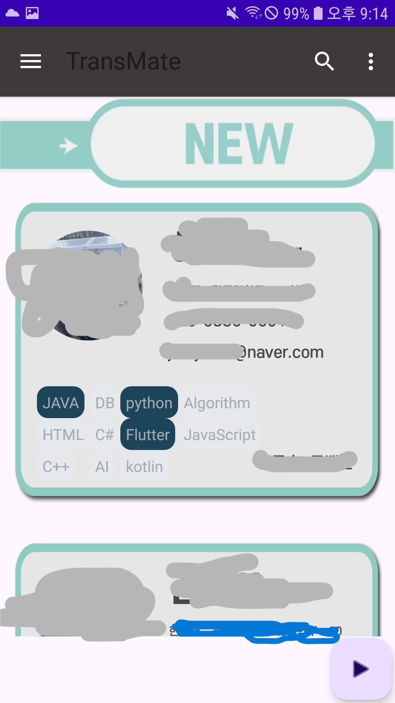

# 환승메이트 프로젝트 (💡 몰입캠프 2주차: 홍성문, 서해린)

- 홍성문: 한양대학교 컴퓨터소프트웨학부 2학년

- 서해린: 카이스트 전산학부 2학년

- 제작기간: 2024-1-4(목) ~ 20204-1-10(수)

- 사용언어🔍: Kotlin, MySQL, SprintBoot, 일러스트레이터

## 1. 프로젝트 소개✏️

환승 메이트는 한 달 동안 서로다른 팀원과 팀프로젝트를 진행해야 하는 몰입캠프의 특성을 고려해 제작하게 되었습니다.
함께 프로젝트를 진행한 전 팀메이트 들이 EX가 되어 익명으로 편지를 남길 수 있고, 다음 프로젝트를 함께 하고 싶은 개발자 에게 편지를 쓰는 것도 가능하다

3주차 까지 3번의 프로젝트를 수행하고, 마지막 4주차에는 서로 받은 편지를 Class에 모여 함께 읽어보는 시간을 가지고 마지막 주차 팀을 구성하는데 도움이 되고자 프로젝트를 설계했다.

    ####앱의 목적과 기능
    1. 로그인 후 MateList 에서 자신의 전팀메이트, 현재 팀메이트, 아직 팀을 하지 못한 인원들을 3개의 Fragment로 볼 수 있다.
        - 각각의 Fragment에는 메이트에 대한 정보와 사용가능 기술 스택을 확인할 수 있다.

    2. WriteLetter 를 누르면 편지지 선택과 편지내용을 작성하고, 추가로 스티커 붙이기 기능을 사용해 이미지 형태의 편지를 제작할 수 있다.

    3. PostBox 에서는 내가 보낸 편지와, 내가 받은 편지를 볼 수 있다.
 
## 2. 핵심 구현 기능🚀

1.이미지 DragDrop

2.Bitmap을 사용해 이미지 합성.

3.DB개발자 정보를 로그인한 사용자 기준으로 분류해 보여주기

4.Kakao SDK와 자체 로그인 기능

5.일러스트레이터로 스티커,로고,배경 디자인 제작

    🚀구현완료 기능
    1. DragDrop 으로 이미지가 Layout을 왔다갔다 할 수 있게 구현.
        - 이미지의 정보를 ArrayList에 저장하며 관리
    2. 텍스트와 편지지Img, DragDrop으로 저장된 ArrayList 세가지를 Bitmap을 통해 하나의 이미지로 완성
        - 텍스트와 편지지를 합친 Img를 만든 다음, DragDrop을 통해 스티커를 붙이는 화면으로 이동
        - for문을 반복하며 저장된 스티커를 모두 합치기
        - GlobalScope 사용해 동기화 문제 해결
    3. RecyclerView를 사용해서, DB에 저장된 개발자 정보를 스크롤 해서 볼 수 있음
        - 개발자 정보는 EX(전 팀메이트), CURRENT(현재 팀메이트), NEW(전체 팀메이트)
        - 사전 설문조사로 사용가능한 언어와 프레임워크 등등을 DB에 저장하고, 표현

    🚨추가할 기능
    [X] 사전 설문조사가 아닌, 버튼 클릭을 통해 기술스택을 변경할 수 있게 만들기(버튼 클릭시 색과 변수가 변경되도록 했지만, DB연결이 되지 않은 상태)
    [X] 회원가입 기능. 새로운 유저가 앱에 가입해서 특정 분반에 참여 가능하도록 인증+DB연결을 만들기
    [X] MateList에서 공개 평가와 평점을 확인할 수 있도록 추가 기능 구현
    [X] DB의 테이블 구성부터 전체적으로 수정을 통해 지금보다 더 적극적인 DB 기능을 구현.

## 3. 화면 이미지🎯

1.Splash 화면

2.Login 화면

|Photo1|Photo2|Photo3|
|--|--|--|
||||

3.MateList 화면

|Photo1|Photo2|Photo3|
|--|--|--|
||||

4.MateLetter

|Photo1|Photo2|Photo3|
|--|--|--|
||||

|Photo1|Photo2|
|--|--|
|||

5. PostBox

|Photo1|Photo2|Photo3|
|--|--|--|
||||

## 4. 프로젝트를 진행하며 어려웠던 점🚨

1. 이미지의 크기가 너무 커서 발생했던 수많은 시행착오가 힘들었다.
2. DB와 Spring부트가 완전 처음이어서 어려웠다.
3. 특히 DB에서 이미지 파일을 불러오고 업로드 하는 부분이 정말 어려웠다.(Img to Base64)
4. 드래그앤 드롭과 스티커를 붙이는 기능 구현이 생각보다 오래 걸렸다.
5. 로그인 기능을 첫날 구현하고 건들지 않아서 나중에 쓰려고 하는데 오류발생했음

